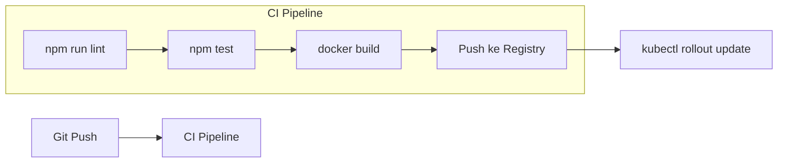

# 🐳 Deployment Guide — PMS Backend

Panduan lengkap untuk deploy PMS Backend di berbagai environment: Development, Docker Compose, dan Kubernetes.

---

## 🌍 Environment Overview

| Environment | Transport | Database | Cache | Cara Deploy |
|---|---|---|---|---|
| **Development** | In-process | NeDB (file) | Memory | `npm run dev` |
| **Docker Compose** | NATS | MongoDB | Redis | `docker compose up` |
| **Kubernetes** | NATS | MongoDB | Redis | `kubectl apply` |

---

## 🔧 Environment Variables

### Variabel Wajib (Production)

```dotenv
# JWT Secret — WAJIB diganti, minimal 32 karakter random!
JWT_SECRET=ganti-dengan-secret-panjang-dan-random-minimal-32-karakter

# Transporter — NATS untuk multi-node
TRANSPORTER=nats://nats:4222

# Database MongoDB
DB_URI=mongodb://mongo:27017/pms

# Redis Cache
REDIS_URI=redis://redis:6379

# Port API Gateway
PORT=3000

# Channel adapter (untuk @moleculer/channels)
CHANNEL_URL=nats://nats:4222

# Workflows adapter
WORKFLOWS_URL=redis://redis:6379
```

### Variabel Opsional

```dotenv
# Node ID (otomatis di-generate jika kosong)
MOLECULER_NODE_ID=pms-api-1

# Log level
LOG_LEVEL=info

# Namespace isolasi (untuk multi-tenant)
NAMESPACE=production
```

---

## 🐳 Docker Compose Deployment

### Struktur Services

```yaml
# docker-compose.yml (sudah tersedia di proyek)
services:
  api:       # PMS Backend (replika bisa ditambah)
  mongo:     # MongoDB 6
  nats:      # NATS 2 (dengan JetStream -js)
  redis:     # Redis Alpine
  traefik:   # Reverse Proxy + Load Balancer
```

### Langkah Deploy

```bash
# 1. Build image
docker compose build

# 2. Jalankan semua services
docker compose up -d

# 3. Cek status
docker compose ps

# 4. Lihat logs API
docker compose logs -f api

# 5. Scale API (2 instansi)
docker compose up -d --scale api=2
```

### Akses Traefik Dashboard

```
http://localhost:3001  → Traefik Dashboard
http://localhost:3000  → API Gateway (via Traefik)
```

### Menghentikan

```bash
# Hentikan tapi simpan data volume
docker compose stop

# Hentikan dan hapus container (data tetap)
docker compose down

# Hentikan dan hapus semua termasuk volume (DATA HILANG!)
docker compose down -v
```

---

## ☸️ Kubernetes Deployment

File `k8s.yaml` sudah tersedia di root proyek.

### Prerequisites

```bash
# Pastikan kubectl terinstall dan connected ke cluster
kubectl version
kubectl config current-context
```

### Deploy ke Kubernetes

```bash
# Deploy semua resources
kubectl apply -f k8s.yaml

# Cek status pods
kubectl get pods

# Cek services
kubectl get services

# Cek logs
kubectl logs -f deployment/api
```

### Scaling

```bash
# Scale API ke 3 replika
kubectl scale deployment api --replicas=3

# Auto-scaling berdasarkan CPU
kubectl autoscale deployment api --cpu-percent=70 --min=2 --max=10
```

---

## 🔄 Alur CI/CD Rekomendasi



### Contoh GitHub Actions (Simplified)

```yaml
# .github/workflows/deploy.yml
name: Deploy PMS Backend

on:
  push:
    branches: [main]

jobs:
  test:
    runs-on: ubuntu-latest
    steps:
      - uses: actions/checkout@v4
      - uses: actions/setup-node@v4
        with:
          node-version: '22'
      - run: npm install
      - run: npm test

  deploy:
    needs: test
    runs-on: ubuntu-latest
    steps:
      - name: Build & Push Docker Image
        run: |
          docker build -t my-registry/pms-backend:${{ github.sha }} .
          docker push my-registry/pms-backend:${{ github.sha }}
      
      - name: Deploy ke Kubernetes
        run: |
          kubectl set image deployment/api api=my-registry/pms-backend:${{ github.sha }}
```

---

## 📊 Monitoring

### Prometheus Metrics

Aktifkan di `moleculer.config.js`:

```javascript
metrics: {
  enabled: true,
  reporter: {
    type: "Prometheus",
    options: {
      port: 3030,
      path: "/metrics"
    }
  }
}
```

Akses: `http://localhost:3030/metrics`

### Distributed Tracing (Jaeger)

Aktifkan di `moleculer.config.js`:

```javascript
tracing: {
  enabled: true,
  exporter: {
    type: "Jaeger",
    options: {
      endpoint: "http://jaeger:14268/api/traces"
    }
  }
}
```

---

## 🔒 Security Checklist Production

- [ ] `JWT_SECRET` diganti dengan string random 64+ karakter
- [ ] CORS dikonfigurasi hanya ke domain frontend (`cors.origin`)
- [ ] Rate limiting diperketat sesuai kebutuhan
- [ ] HTTPS/TLS dikonfigurasi di load balancer/Traefik
- [ ] Database tidak expose port ke luar (hanya di internal network)
- [ ] NATS authentication diaktifkan
- [ ] Redis authentication diaktifkan
- [ ] Environment variables tidak di-hardcode di kode
- [ ] `log4XXResponses` tidak aktif di production untuk mengurangi noise log
- [ ] Circuit breaker diaktifkan
- [ ] Health check endpoint dikonfigurasi
- [ ] Docker image menggunakan user non-root

---

## 🏥 Health Check

Tambahkan endpoint health check (TODO: implementasi):

```javascript
// services/api.service.js
routes: [
  {
    path: "/health",
    aliases: {
      "GET /": (req, res) => {
        res.end(JSON.stringify({ status: "ok", timestamp: new Date() }));
      }
    }
  },
  // ... route /api yang sudah ada
]
```

Docker health check di `docker-compose.yml`:

```yaml
api:
  healthcheck:
    test: ["CMD", "curl", "-f", "http://localhost:3000/health"]
    interval: 30s
    timeout: 10s
    retries: 3
    start_period: 40s
```
