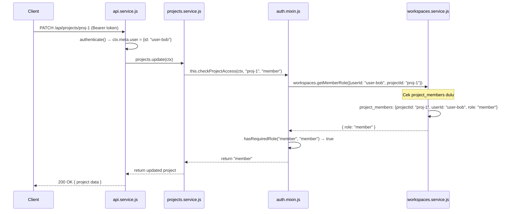

# 🔐 RBAC — Sistem Otorisasi Berbasis Peran Kontekstual

Dokumentasi ini menjelaskan secara lengkap sistem **Role-Based Access Control (RBAC)** yang diimplementasikan di PMS Backend, mulai dari desain, alur kerja, hingga cara pengembangannya.

---

## 📌 Konsep Dasar

PMS menggunakan **Contextual RBAC** — artinya, satu user bisa memiliki peran (role) yang **berbeda** di konteks yang berbeda:

- User A bisa jadi **Admin** di Workspace 1
- User A bisa jadi **Viewer** di Workspace 2
- User A bisa jadi **Member** di Project X (meskipun hanya Viewer di workspace-nya)

---

## 🏗️ Model Data

### Users
```json
[
  { "id": "user-admin", "username": "admin", "email": "admin@example.com" },
  { "id": "user-alice", "username": "alice", "email": "alice@example.com" },
  { "id": "user-bob",   "username": "bob",   "email": "bob@example.com"   }
]
```

### Workspaces
```json
[
  { "id": "ws-1", "name": "Engineering", "ownerId": "user-admin" },
  { "id": "ws-2", "name": "Marketing",   "ownerId": "user-charlie" }
]
```

### workspace_members (Keanggotaan Workspace)
```json
[
  { "workspaceId": "ws-1", "userId": "user-admin", "role": "admin"  },
  { "workspaceId": "ws-1", "userId": "user-alice", "role": "member" },
  { "workspaceId": "ws-1", "userId": "user-bob",   "role": "viewer" }
]
```

### Projects
```json
[
  { "id": "proj-1", "workspaceId": "ws-1", "name": "Platform Rewrite" },
  { "id": "proj-2", "workspaceId": "ws-1", "name": "Mobile App" }
]
```

### project_members (Override Role per Proyek)
```json
[
  { "projectId": "proj-1", "userId": "user-bob", "role": "member" }
]
```

> Meskipun Bob hanya `viewer` di `ws-1`, ia punya override `member` khusus di `proj-1`.

---

## 🎭 Role Hierarchy

```
viewer  <  member  <  admin
  0          1          2
```

- **viewer** — Hanya bisa membaca data
- **member** — Bisa membaca dan membuat/mengedit (terbatas)
- **admin** — Bisa melakukan semua operasi termasuk hapus dan kelola member

**Implementasi hierarchy:**
```javascript
// mixins/auth.mixin.js
const ROLE_HIERARCHY = ["viewer", "member", "admin"];

function hasRequiredRole(userRole, requiredRole) {
  const userIdx     = ROLE_HIERARCHY.indexOf(userRole);
  const requiredIdx = ROLE_HIERARCHY.indexOf(requiredRole);
  return userIdx >= requiredIdx;  // ← Admin (2) >= Member (1) → true
}
```

---

## 🔄 Alur Resolusi Role

Ketika ada request ke endpoint yang butuh otorisasi, alur berikut terjadi:



---

## 📊 Matrix Akses

### Workspace Actions

| Action | Viewer | Member | Admin |
|---|:---:|:---:|:---:|
| `GET /workspaces` | ✅ | ✅ | ✅ |
| `GET /workspaces/:id` | ✅ | ✅ | ✅ |
| `POST /workspaces/:id/members` | ❌ | ❌ | ✅ |

### Project Actions

| Action | Viewer | Member | Admin |
|---|:---:|:---:|:---:|
| `GET /projects` | ✅ | ✅ | ✅ |
| `GET /projects/:id` | ✅ | ✅ | ✅ |
| `POST /projects` | ❌ | ✅ | ✅ |
| `PATCH /projects/:id` | ❌ | ✅ | ✅ |
| `DELETE /projects/:id` | ❌ | ❌ | ✅ |

### Task Actions (Planned)

| Action | Viewer | Member | Admin |
|---|:---:|:---:|:---:|
| `GET /tasks` | ✅ | ✅ | ✅ |
| `GET /tasks/:id` | ✅ | ✅ | ✅ |
| `POST /tasks` | ❌ | ✅ | ✅ |
| `PATCH /tasks/:id` | ❌ | ✅ | ✅ |
| `DELETE /tasks/:id` | ❌ | ❌ | ✅ |
| Assign task ke user | ❌ | ✅ | ✅ |

---

## 🧩 Cara Menggunakan Auth Mixin

### Langkah 1: Import dan Tambahkan ke Mixins

```javascript
const AuthMixin = require("../mixins/auth.mixin");

module.exports = {
  name: "tasks",
  mixins: [AuthMixin],  // ← Tambahkan di sini
  // ...
};
```

### Langkah 2: Gunakan Method di Handler

```javascript
actions: {
  create: {
    rest: "POST /",
    auth: "required",
    params: {
      projectId: "string",
      title: "string"
    },
    async handler(ctx) {
      const { projectId, title } = ctx.params;
      
      // ← CUKUP SATU BARIS untuk otorisasi
      await this.checkProjectAccess(ctx, projectId, "member");
      
      // Jika lolos, lanjut buat task
      const task = { id: `task-${Date.now()}`, projectId, title };
      return task;
    }
  }
}
```

### Pilih Level Otorisasi yang Tepat

```javascript
// Hanya butuh bisa baca:
await this.checkProjectAccess(ctx, projectId, "viewer");

// Butuh bisa edit:
await this.checkProjectAccess(ctx, projectId, "member");

// Hanya admin yang boleh:
await this.checkProjectAccess(ctx, projectId, "admin");

// Cek akses workspace (bukan project):
await this.checkWorkspaceAccess(ctx, workspaceId, "admin");
```

---

## 🚨 Error Codes

| Error | HTTP Status | Kode Error | Penyebab |
|---|---|---|---|
| Tidak ada token | 401 | `ERR_UNAUTHENTICATED` | Request tanpa `Authorization: Bearer ...` di protected route |
| Token invalid/expired | 401 | `ERR_INVALID_TOKEN` | Token rusak atau sudah expired |
| Bukan anggota | 403 | `ERR_FORBIDDEN` | User tidak terdaftar sebagai member workspace/project |
| Role tidak cukup | 403 | `ERR_FORBIDDEN` | User adalah viewer tapi butuh member/admin |

**Contoh response error:**
```json
{
  "name": "MoleculerError",
  "message": "Insufficient permissions. Required: \"member\", your role: \"viewer\"",
  "code": 403,
  "type": "ERR_FORBIDDEN",
  "data": {
    "userId": "user-bob",
    "projectId": "proj-2",
    "effectiveRole": "viewer",
    "requiredRole": "member"
  }
}
```

---

## 🧪 Scenario Testing

### Scenario 1: Admin Mengupdate Proyek → ✅ Berhasil

```
User: user-admin
Role di ws-1: admin
Project: proj-1 (dalam ws-1)
Aksi: PATCH /api/projects/proj-1

→ getMemberRole(userId: "user-admin", projectId: "proj-1")
→ Tidak ada di project_members
→ Cek workspace_members: ws-1 → admin
→ hasRequiredRole("admin", "member") = true ✅
→ 200 OK
```

### Scenario 2: Viewer Mencoba Edit → ❌ Ditolak

```
User: user-bob
Role di ws-1: viewer
Project: proj-2 (dalam ws-1)
Aksi: PATCH /api/projects/proj-2

→ getMemberRole(userId: "user-bob", projectId: "proj-2")
→ Tidak ada di project_members
→ Cek workspace_members: ws-1 → viewer
→ hasRequiredRole("viewer", "member") = false ❌
→ 403 ERR_FORBIDDEN
```

### Scenario 3: Bob dengan Override Member → ✅ Berhasil

```
User: user-bob
Role di ws-1: viewer (default)
Override di proj-1: member
Aksi: PATCH /api/projects/proj-1

→ getMemberRole(userId: "user-bob", projectId: "proj-1")
→ Ada di project_members: proj-1 → member (PRIORITY!)
→ hasRequiredRole("member", "member") = true ✅
→ 200 OK
```

---

## 🔮 Pengembangan Lanjutan (Roadmap RBAC)

### Menambah Role Baru (misal: `contributor`)

1. Tambahkan ke `ROLE_HIERARCHY` di `auth.mixin.js`:
   ```javascript
   const ROLE_HIERARCHY = ["viewer", "contributor", "member", "admin"];
   ```

2. Tambahkan ke enum validation di `workspaces.service.js`:
   ```javascript
   role: { type: "enum", values: ["admin", "member", "contributor", "viewer"] }
   ```

3. Update seed data dan dokumentasi.

### Fitur yang Direncanakan

- **Permission-based (tidak hanya role-based):** contoh, izin spesifik `task:delete` bisa diberikan ke member tertentu tanpa menjadikannya admin.
- **Custom roles per workspace:** admin workspace bisa membuat role kustom.
- **Audit log:** setiap akses dicatat (siapa, kapan, action apa).
